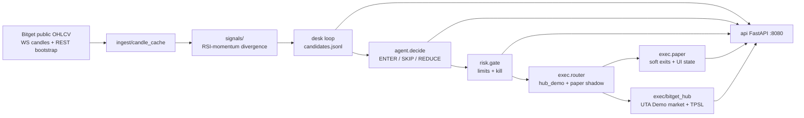

# Bitget S2 — Divergent Agent Desk / Divergent Agent Desk

> **EN one-liner:** Bitget S2 Divergent Agent Desk (Agent Trading): public OHLCV → RSI/level-cross signals → rules agent → risk gate → **Bitget Demo UTA** (`hub_demo`) + paper shadow → FastAPI dashboard.  
> **RU one-liner:** Bitget S2 Divergent Agent Desk: публичный OHLCV → сигналы RSI/level-cross → rules-агент → риск-гейт → **Bitget Demo UTA** (`hub_demo`) + paper shadow → FastAPI-дашборд.

**Track:** Agent Trading / Divergent Agent Desk  
**Mode (recommended):** `EXEC_MODE=hub_demo`, `BITGET_DEMO=1`, `BITGET_ALLOW_LIVE=0` — Demo market orders on Bitget UTA (`paptrading`) with local paper book for soft exits/UI. Public OHLCV needs no keys; Demo keys stay in local `.env` only.

---

## Architecture / Архитектура



ASCII:

```
Bitget public OHLCV (WS candles + REST bootstrap)
        |
        v
   ingest/candle_cache + bitget_ws
        |
        v
   signals/ (RSI-momentum divergence)
        |
        v
   desk loop --> data/candidates.jsonl
        |
        +--> agent.decide (AGENT_MODE=rules|llm; llm optional, rules fallback)
        |         |
        |         v
        |    risk.gate (notional / daily loss / max pos / cooldown)
        |         |
        |         v
        |    exec.router (EXEC_MODE=hub_demo|paper|live)
        |         |
        |         +--> exec.bitget_hub (Demo UTA market open/close + exchange SL/TP2)
        |         +--> exec.paper (shadow book: soft TP1/BE/trail, fills, equity overlay)
        |
        v
   api/ FastAPI dashboard  http://127.0.0.1:8080  (PnL from Demo when hub_demo)
```

---

## How it uses Bitget / Как используется Bitget

| Today (S2 demo) | Optional / later |
|-----------------|------------------|
| **Public** Bitget OHLCV via WS candles (`MARKET_DATA_MODE=ws`) + REST bootstrap; exec stays REST `hub_demo` | LLM via `AGENT_MODE=llm` (OpenAI-compatible); rules fallback |
| **Demo execution** via UTA v3 (`exec/bitget_hub.py`): market open/close, exchange SL+TP2, sync SL after soft TP1/BE/trail | Policy Trader layer (ENTER/SKIP/size from symbol stats) — not wired yet |
| Symbols: ccxt **swap only** (NO SPOT) e.g. `BTC/USDT:USDT`, rToken perps | Live (`EXEC_MODE=live`) guarded by `BITGET_ALLOW_LIVE=1` — not for hackathon demo |
| Dashboard: real Demo PnL/entry/mark, equity overlay, auto-refresh 8s | GitHub push / submission video — see `docs/SUBMISSION.md` |

**EN:** Full agent loop on public data + Bitget Demo execution with paper shadow for exits and UI. Exchange leverage stays at Bitget default (often 20×); do not force 1×.  
**RU:** Полный цикл на публичных данных + исполнение на Bitget Demo; paper book — soft exits и UI. Плечо на бирже не форсим.

---

## Risk controls / Контроль рисков

Risk gate (`risk/gate.py`) + risk-to-SL sizing (`risk/sizing.py`), env defaults:

| Control | Env | Default |
|---------|-----|---------|
| Risk per trade (sized to SL distance) | `RISK_USD_PER_TRADE` | 2 |
| Max notional per entry | `MAX_NOTIONAL_USD` | 100 |
| Min notional | `MIN_NOTIONAL_USD` | 10 |
| Daily loss kill switch | `MAX_DAILY_LOSS_USD` | 50 |
| Max open positions | `MAX_POSITIONS` | 8 |
| One position per symbol | `ONE_POSITION_PER_SYMBOL` | true |
| Per-symbol cooldown | `COOLDOWN_SEC` | 900 |
| Optional type filter | `ALLOWED_TYPES` | e.g. `BULLISH_DIV,BEARISH_DIV` |

Agent rules also skip RSI extremes (`RSI_OVERBOUGHT` / `RSI_OVERSOLD`). All decisions → `data/decisions.jsonl`.

---


---

## Hub demo execution / Bitget Demo

Recommended env (see `.env.example`):

| Env | Default | Role |
|-----|---------|------|
| `EXEC_MODE` | `hub_demo` | `paper` \| `hub_demo` \| `live` (guarded) |
| `BITGET_DEMO` | `1` | `paptrading=1` on UTA REST |
| `BITGET_ALLOW_LIVE` | `0` | blocks live unless explicitly enabled |
| `HUB_SYNC_EXCHANGE_SL` | `1` | push SL to exchange after soft TP1/BE/trail |

On open: exchange **SL + TP2** (`place-strategy-order` tpsl). Soft **TP1 / BE / trail** stay in `risk/exits.py` on the paper shadow. Smokes: `scripts/smoke_hub_demo.py`, `scripts/smoke_router_demo.py`.

## ATR exits / TP·SL

Ported from divergent paper tracker (paper shadow + hub sync):

- On open: ATR = mean(high−low).tail(14), floor `max(atr, entry×0.02)` → SL / TP1 / TP2 stored on position + meta.
- Filter: skip open if `atr_pct` &lt; 0.3% or &gt; 6%.
- Desk loop each pass (or `EXIT_CHECK_SEC`): candle high/low vs SL/TP; TP1 → SL to BE + trailing; TP2 → `tp2_hit`; SL → `sl_hit` / `trailing_hit`.
- Env-gated: `BE_HOURS` (default 8), `MAX_HOLD_HOURS` → `expired`, `MAX_LOSS_PCT_OF_MARGIN` → `dollar_stop`.
- Modules: `risk/atr.py`, `risk/exits.py`; retag: `scripts/retag_open_sl_tp.py`; smoke: `scripts/smoke_exits.py`.
- `/positions` exposes `sl`, `tp1`, `tp2`, `atr`, `tp1_hit`, `trailing_active`, `exit_status`.


## Modules / Модули

| Path | Role |
|------|------|
| `signals/` | Ported detector, indicators, models, `engine.run_full_detection` |
| `ingest/bitget_ohlcv.py` | REST `fetch_ohlcv` / `get_ohlcv` (cache-then-REST) |
| `ingest/bitget_ws.py` | Public WS candles + tickers, shard/reconnect |
| `ingest/candle_cache.py` | In-memory OHLCV + mark cache |
| `ingest/universe.py` | Auto-scan: crypto USDT-M vs rToken/RWA stock perps (NO SPOT); rank by 24h quote volume |
| `desk/` | Candle → signal → candidate JSONL loop |
| `agent/decide.py` | ENTER / SKIP / REDUCE; `AGENT_MODE=rules` (default) or optional `llm` with rules fallback |
| `risk/gate.py` | Paper risk gate |
| `exec/router.py` | Routes open/close: paper \| hub_demo \| live |
| `exec/bitget_hub.py` | Bitget UTA v3 Demo/live client (market, TPSL, `pricePlace`) |
| `exec/hub_balance.py` | Demo equity overlay on paper account snapshot |
| `exec/paper.py` | Paper shadow fills + open positions |
| `exec/account.py` | Paper cash wallet + equity (`PAPER_START_BALANCE_USD`) |
| `api/app.py` | FastAPI dashboard (Demo PnL when `hub_demo`) |
| `scripts/smoke_*.py` | Offline / public-data smoke tests |
| `scripts/run_signal_loop.py` | Multi-symbol poll/once candidate logger |
| `scripts/run_api.py` | uvicorn dashboard (`HOST`/`PORT` env; Docker uses `0.0.0.0:8080`) |

---

## Quickstart — local / Локально

```bash
cd C:\bitget-bot
python -m venv .venv
.venv\Scripts\activate
pip install -r requirements.txt
copy .env.example .env
# Fill BITGET_* Demo keys for hub_demo; public OHLCV smokes work without keys
```

Smoke (no network except Bitget public for `smoke_bitget`):

```bash
.venv\Scripts\python.exe scripts\smoke_signal.py
.venv\Scripts\python.exe scripts\smoke_bitget.py
.venv\Scripts\python.exe scripts\smoke_risk.py
.venv\Scripts\python.exe scripts\smoke_decide.py
.venv\Scripts\python.exe scripts\smoke_llm_decide.py
.venv\Scripts\python.exe scripts\smoke_paper.py
.venv\Scripts\python.exe scripts\smoke_account.py
```

Once scan + API:

```bash
.venv\Scripts\python.exe scripts\run_signal_loop.py --once
.venv\Scripts\python.exe scripts\run_api.py
# open http://127.0.0.1:8080/  |  curl http://127.0.0.1:8080/health
```

Poll desk:

```bash
.venv\Scripts\python.exe scripts\run_signal_loop.py --poll
```

---

## Quickstart — Docker / Docker

Requires Docker Desktop. Set `.env` from example (`EXEC_MODE=hub_demo` + Demo keys for trading smokes).

```bash
cd C:\bitget-bot
copy .env.example .env
docker compose build
docker compose up -d
# API:  http://127.0.0.1:8080/
# Desk: continuous --poll into ./data (volume)
docker compose logs -f desk
docker compose down
```

Services:

| Service | Command | Ports | Restart |
|---------|---------|-------|---------|
| `api` | `python scripts/run_api.py` | `8080:8080` | unless-stopped |
| `desk` | `python scripts/run_signal_loop.py --poll` | — | unless-stopped |

Shared volume: `./data` → `/app/data`. Image default CMD is the API; compose overrides for `desk`.

---


---

## Universe auto-scan / Auto-scan (perps only)

**NO SPOT.** Desk scans Bitget **USDT-M linear swaps** only:

| Basket | How identified | Env |
|--------|----------------|-----|
| Crypto USDT-M | `info.isRwa == NO` (linear USDT swap) | `SCAN_CRYPTO_TOP` (default 70) |
| rToken / RWA stock perps | Prefer Bitget `info.isRwa == YES` (e.g. AAPL/USDT:USDT, ETFs, indices, tokenized equities, RWA commodities). Fallback: base ends with `STOCK` or curated equity tickers | `SCAN_RTOKEN_TOP` (default 30) |

| Env | Default | Notes |
|-----|---------|-------|
| `SCAN_MODE` | `auto` | `auto` = top crypto union top rToken each refresh; `fixed` = use `SYMBOLS` only |
| `SCAN_REFRESH_SEC` | `300` | `0` = refresh every desk pass |
| `MARKET_DATA_MODE` | `ws` | `ws` = public candles/tickers; `rest` = legacy poll. Execution stays REST `hub_demo` |
| `OHLCV_LIMIT` | `200` | Faster auto scans / WS bootstrap depth |
| `SYMBOLS` | — | Used when `SCAN_MODE=fixed` |

Smoke:

```bash
.venv\Scripts\python.exe scripts\smoke_universe.py
```

## Demo checklist / Чеклист демо

- [ ] `EXEC_MODE=hub_demo`, `BITGET_DEMO=1`, `BITGET_ALLOW_LIVE=0` — Demo UTA, not live mainnet
- [ ] Demo keys in `.env` (never commit); public OHLCV smokes need no keys
- [ ] Smoke: `smoke_signal` → `smoke_bitget` → `smoke_risk` → `smoke_decide` → `smoke_llm_decide` → `smoke_paper` → `smoke_account`
- [ ] One desk pass: `python scripts/run_signal_loop.py --once`
- [ ] API up: `http://127.0.0.1:8080/health` → `ok`, `exec_mode":"hub_demo"`, `bitget_demo":true`
- [ ] Dashboard: `http://127.0.0.1:8080/` shows decisions / positions
- [ ] Optional Docker: `docker compose up -d` then same API URL
- [ ] Show `data/candidates.jsonl` + `data/decisions.jsonl` (gitignored)

---

## Bitget S2 submission checklist / Чеклист подачи S2

- [ ] **GitHub repo** public: `https://github.com/scanner72/bitget-bot` (or your fork)
- [ ] **Demo video** (2–5 min): pitch → hub_demo execution → smoke/API → Demo dashboard: `https://_________________`
- [ ] **X / Twitter post** with repo + video + #Bitget #AgentTrading: `https://x.com/_________________/status/_________________`
- [ ] README (this file) EN+RU pitch + diagram + quickstart
- [ ] Docker packaging (`Dockerfile`, `docker-compose.yml`) for judges
- [ ] Confirm Demo-only / no secrets in repo (`.env` gitignored)

---

## API endpoints

| Method | Path | Notes |
|--------|------|-------|
| GET | `/health` | `{ ok, paper, exec_mode, hub_demo, bitget_demo, hub_sync_exchange_sl }` |
| GET | `/positions` | Open positions (Demo PnL/entry/mark when `hub_demo`) |
| GET | `/decisions?limit=50` | Tail `data/decisions.jsonl` |
| GET | `/fills?limit=50` | Tail `data/paper_fills.jsonl` |
| GET | `/candidates?limit=50` | Tail `data/candidates.jsonl` |
| GET | `/equity` | Account snapshot (Demo equity overlay when `hub_demo`) |
| GET | `/account` | Same as `/equity` |
| GET | `/` | HTML dashboard (click open position or history row → LIVE chart) |
| GET | `/chart` | Lightweight-charts page (v1 overlay: entry/SL/TP/exit on LIVE Bitget candles) |
| GET | `/api/chart/data` | `{ candles, rsi, markers, zones }` from public Bitget OHLCV |
| GET | `/history` | Closed trades for history chart clicks |

### Symbol display (Bitget-readable)

API/dashboard keep ccxt `symbol` (e.g. `CRCL/USDT:USDT`) for trading keys and add `symbol_id` (Bitget native `CRCLUSDT`) + `symbol_display` (`CRCL-USDT Perp`) via `ingest/symbols.py`. HTML `/` shows the display form (muted id). Smoke: `scripts/smoke_symbols.py`.

### Unrealized PnL (mark-to-market)

Open paper positions on `GET /positions` include `mark_price`, `unrealized_pnl_usd`, and `unrealized_pnl_pct` (Bitget swap ticker last/mark via ccxt). `GET /equity` and `GET /account` add `total_unrealized_pnl` and `equity_mtm` (= cash + open_notional + unrealized; aligns with start + realized + upnl). If a ticker fetch fails, that row's upnl fields are `null` with `mtm_error` (API does not crash). HTML `/` shows per-row uPnL (green/red) and total uPnL. Smoke: `scripts/smoke_upnl.py` (mocked prices, no network).

`POST /scan/once` is **not** exposed (OHLCV pass can exceed short HTTP timeouts). Run scans via `scripts/run_signal_loop.py`.

---

## Agent decide / LLM (optional)

Default `AGENT_MODE=rules` — unchanged rules path. Set `AGENT_MODE=llm` to call an OpenAI-compatible Chat Completions API with candidate JSON + risk context; model returns strict `{action, size_usd, side, rationale}`. On timeout/error/invalid JSON, falls back to rules and sets `rules_fired` including `llm_fallback`. Live LLM is **not** required — `scripts/smoke_llm_decide.py` covers rules + unreachable-URL fallback.

## Env highlights

See `.env.example`. Important:

- `EXEC_MODE=hub_demo`, `BITGET_DEMO=1`, `HUB_SYNC_EXCHANGE_SL=1` — recommended S2 demo stack
- `PAPER=true` — keep on (paper shadow book always used)
- `RISK_USD_PER_TRADE`, `MIN_NOTIONAL_USD`, `MAX_NOTIONAL_USD` — risk-to-SL sizing
- `SYMBOLS`, `TIMEFRAME`, `POLL_SEC`, `ONCE`
- Risk / agent knobs as in Risk controls above
- `AGENT_MODE=rules|llm` (default `rules`). LLM optional for Agent Hub / hackathon demos — not required for success
- When `llm`: `OPENAI_BASE_URL` (default `http://127.0.0.1:8787/v1` Headroom), `OPENAI_API_KEY`, `OPENAI_MODEL`; any failure → rules + `llm_fallback`
- `BITGET_API_KEY` / `BITGET_SECRET_KEY` / `BITGET_PASSPHRASE` — Demo UTA keys in local `.env` only; do not commit

---


---

## Demo pack / Пакет для демо

- Recording script (RU, 2–3 min): [docs/DEMO.md](docs/DEMO.md)
- Submission checklist (GitHub TBD, X template, deadline **21 Sep**): [docs/SUBMISSION.md](docs/SUBMISSION.md)
- Static API snapshots for screenshots: [docs/demo_artifacts/](docs/demo_artifacts/) (health.json, positions.json, decisions.json, fills.json, snapshot.html)

Start API locally (hub_demo):

```bash
.venv\Scripts\python.exe -u scripts\run_api.py
# pid optionally saved to data/api.pid
# http://127.0.0.1:8080/health  -> exec_mode hub_demo
```

## Disclaimer

**EN:** Educational / hackathon demo on Bitget UTA Demo (`paptrading`). Not financial advice. Live mainnet blocked unless `BITGET_ALLOW_LIVE=1`.  
**RU:** Учебный / хакатонный demo на Bitget Demo. Не инвестиционная рекомендация. Live mainnet по умолчанию выключен.
