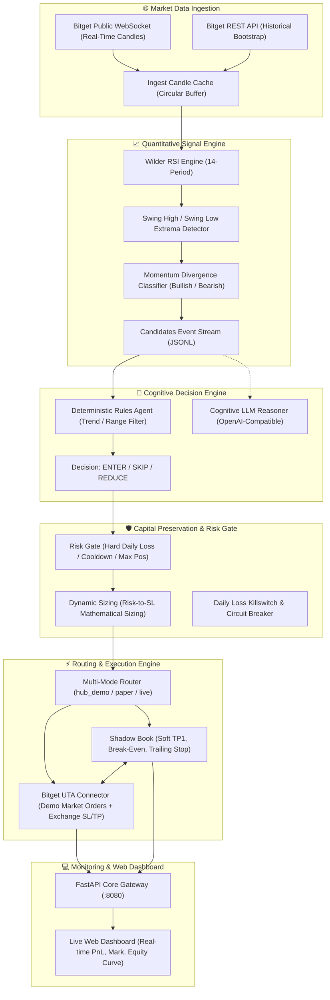

<div align="center">

# 🛸 Bitget S2 — Divergent Agent Desk
### Autonomous Quantitative Trading Agent, Structural Divergence Engine & Bitget UTA Shadow Execution Fabric

[](https://github.com/scanner72/bitget-bot/actions)
[](https://www.python.org/)
[](https://fastapi.tiangolo.com/)
[](https://github.com/ccxt/ccxt)
[](https://www.bitget.com)
[](https://www.docker.com/)
[](LICENSE)

**[English](README.md)** • **[Русский](README.ru.md)** • **[Architecture](docs/architecture.md)** • **[Risk Engine](docs/risk-engine.md)** • **[Strategy Guide](docs/strategy-divergence.md)** • **[API Reference](docs/api-reference.md)** • **[Deployment](docs/deployment-guide.md)** • **[AI Fleet](docs/agents-setup.md)**

<p align="center">
  <b>Bitget S2 Divergent Agent Desk</b> bridges algorithmic market microstructure with autonomous cognitive trading.<br/>
  Streaming 100% public Bitget OHLCV candles, detecting RSI-momentum divergences, evaluating strict mathematical risk constraints, and executing on <b>Bitget Universal Trading Account (UTA)</b> Demo with a synchronized local paper shadow book.
</p>

---

</div>

## 🌟 Why Divergent Agent Desk?

Most retail trading bots fall into two dangerous extremes:
- **Rigid Grid Bots**: Blindly dollar-cost average into falling markets until account liquidation during strong trend expansions.
- **Overfitted "Black-Box" Algos**: Rely on lagging indicators without understanding momentum divergence, volatility regime shifts, or multi-stage scaling.
- **Uncontrolled Drawdown**: Fixed position sizing risks catastrophic losses when market conditions change.

**Bitget S2 Divergent Agent Desk fundamentally redesigns the quant workflow:**
1. **Zero-Secret Market Ingestion**: Ingests live candles via public WebSockets and REST bootstraps without exposing API keys.
2. **Structural RSI Divergence**: Identifies true institutional accumulation and distribution phases.
3. **Risk-to-SL Sizing**: Every single trade notional is mathematically calculated from the Stop-Loss distance so capital loss is strictly bounded to the dollar risk target.
4. **Bitget UTA Demo Execution with Shadow Book**: Places hard demo market entries and exchange-side SL/TP2 brackets on Bitget, while locally managing soft TP1 (50% scale-out) and shifting stop-losses to **Break-Even**.

---

## ⚡ Feature Matrix & Competitive Comparison

| Capability | Divergent Agent Desk | 3Commas / Bitsgap | Freqtrade | Hummingbot | Bitget CopyTrading |
|:---|:---:|:---:|:---:|:---:|:---:|
| **Public Data Ingestion (Zero Keys Required)** | **✅ WebSocket + REST** | ❌ Requires keys | ⚠️ Exchange specific | ⚠️ Exchange specific | ❌ Closed |
| **Mathematical Risk-to-SL Sizing** | **✅ Exact Dollar Loss Sizing**| ❌ Fixed / % only | ⚠️ Custom code | ❌ Manual spread | ❌ Fixed ratio |
| **Bitget UTA v3 Demo Support** | **✅ Native `hub_demo`** | ⚠️ Generic API | ⚠️ Basic CCXT | ⚠️ Partial | ❌ Live only |
| **Soft Multi-Stage Exits (TP1 / BE / Trail)** | **✅ Paper Shadow Book** | ⚠️ Partial / Paid | ⚠️ Custom code | ❌ No | ❌ Trader dependent |
| **Autonomous Circuit Breaker & Daily Kill** | **✅ Built-in Risk Gate** | ⚠️ Basic | ⚠️ Custom hooks | ❌ No | ❌ No |
| **Reactive Web Dashboard (:8080)** | **✅ FastAPI + Realtime PnL** | ⚠️ Cloud only | ⚠️ Webserver plugin | ❌ CLI only | ⚠️ Bitget App |
| **Cognitive Agent Layer (Rules / LLM)** | **✅ Built-in Reasoner** | ❌ No | ❌ No | ❌ No | ❌ Human only |
| **100% Self-Hosted & Private** | **✅ MIT License** | ❌ Closed SaaS | ✅ Self-hosted | ✅ Self-hosted | ❌ Centralized |

---

## 🏛️ System Architecture



---

## 🛡️ Mathematical Risk Control Matrix

| Metric | Env Variable | Default | Purpose |
|:---|:---|:---:|:---|
| **Risk Per Trade** | `RISK_USD_PER_TRADE` | `$2.00` | Target dollar loss if position hits Stop-Loss. |
| **Max Notional** | `MAX_NOTIONAL_USD` | `$100.00` | Maximum allowable notional exposure per position. |
| **Min Notional** | `MIN_NOTIONAL_USD` | `$10.00` | Minimum viable notional to meet exchange constraints. |
| **Daily Loss Limit** | `MAX_DAILY_LOSS_USD` | `$50.00` | Hard circuit breaker halting all new entries until next session. |
| **Max Open Positions** | `MAX_POSITIONS` | `8` | Maximum concurrent active positions across all pairs. |
| **Per-Symbol Cooldown**| `COOLDOWN_SEC` | `900` | 15-minute cool-off period before re-entering same asset. |

👉 **[Read the complete Risk Engine Specification](docs/risk-engine.md)**

---

## 🌐 Universal Cross-Platform Architecture

Bitget S2 Divergent Agent Desk runs natively across **Linux**, **macOS**, and **Windows**:

| Component / Capability | 🐧 Linux (Ubuntu, Debian, Arch) | 🍏 macOS (Apple Silicon & Intel) | 🪟 Windows (10, 11, WSL2) |
|:---|:---|:---|:---|
| **Containerization** | Docker Engine 24+ & Docker Compose | Docker Desktop (Native `arm64` / `amd64`) | Docker Desktop (WSL2 Backend) |
| **Python Runtime** | Native Python 3.11 / 3.12 | Native Python 3.11 / 3.12 | Native Python 3.11 / 3.12 |
| **1-Click Platform Launcher** | `./start.sh` | `./start.sh` | `.\start.ps1` or `start.bat` |
| **Automated Test Runner** | `./test.sh` | `./test.sh` | `.\test.ps1` |
| **Remote Server Deployer** | `./deploy-remote.sh` | `./deploy-remote.sh` | `.\deploy-remote.ps1` |

---

## 🚀 Quick Start in 60 Seconds

### 1. Launch with 1-Click Script
```powershell
# Windows (PowerShell):
.\start.ps1

# Linux / macOS:
./start.sh
```

### 2. Or Launch with Docker Compose
```bash
cp .env.example .env
docker compose up -d --build
```

### 3. Open Web Dashboard & Endpoints

| Service | URL | Purpose |
|:---|:---|:---|
| **Web Dashboard** | [http://localhost:8080](http://localhost:8080) | Live PnL, mark prices, positions, and equity overlay |
| **REST Health** | [http://localhost:8080/health](http://localhost:8080/health) | System health and execution mode status |
| **Candidates** | [http://localhost:8080/candidates](http://localhost:8080/candidates) | Active RSI divergence signal stream |
| **Positions** | [http://localhost:8080/positions](http://localhost:8080/positions) | Open positions and soft-exit stages |

> 💡 **No exchange API keys required for testing:** By default, market data is 100% public, and paper mode requires zero credentials!

---

## 🤖 AI Agent Fleet & Context Sync Integration

- **Cursor & Windsurf**: Configured via [`.cursorrules`](.cursorrules).
- **Claude Code CLI & Claude Desktop**: Configured via [`CLAUDE.md`](CLAUDE.md).
- **Google Antigravity**: Configured via [`AGENTS.md`](AGENTS.md).
- **Remote Context Sync**: Connect to [Remote Context (`context-sync`)](https://github.com/scanner72/context-sync) to automatically persist all trade decisions, soft-exit calibrations, and risk updates across your workstation fleet.

👉 **[Read the AI Agent Setup Guide](docs/agents-setup.md)**

---

## 💻 Remote Server Deployment

Deploy the entire platform to your remote Linux VPS (AWS, Hetzner, DigitalOcean) with one command:

```powershell
# Windows:
.\deploy-remote.ps1 -RemoteHost "10.10.10.11" -RemoteUser "operator" -RemotePath "/opt/bitget-bot"
```

```bash
# Linux / macOS:
./deploy-remote.sh 10.10.10.11 operator /opt/bitget-bot
```

👉 **[Read the Production Deployment Guide](docs/deployment-guide.md)**

---

## 🧪 Testing & Verification

Run the automated test and smoke suite:
```powershell
# Windows:
.\test.ps1

# Linux / macOS:
./test.sh
```

---

## 🤝 Contributing & Community

Contributions are warmly welcome! Whether you are refining signal indicators or adding machine learning filters:
- **[CONTRIBUTING.md](CONTRIBUTING.md)**: PR workflows and coding standards.
- **[CODE_OF_CONDUCT.md](CODE_OF_CONDUCT.md)**: Community standards.
- **[SECURITY.md](SECURITY.md)**: Financial security policy and vulnerability reporting.

---

## 📄 License

Distributed under the **MIT License**. See [LICENSE](LICENSE) for details.

<div align="center">
  <sub>Built with ❤️ for quantitative traders and autonomous agent developers.</sub>
</div>
