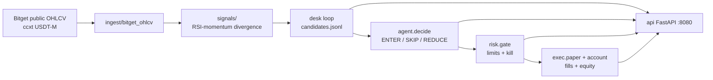

# Bitget S2 — Divergent Agent Desk / Divergent Agent Desk

> **EN one-liner:** Paper-only RSI–momentum divergence agent desk for Bitget (Agent Trading track): public OHLCV → signals → rules agent → risk gate → paper fills → FastAPI dashboard.  
> **RU one-liner:** Paper-only агентский desk на Bitget (трек Agent Trading): публичный OHLCV → дивергенции RSI–momentum → rules-агент → риск-гейт → paper-сделки → FastAPI-дашборд.

**Track:** Agent Trading / Divergent Agent Desk  
**Mode:** `PAPER=true` only — no live orders, no private Bitget keys required for public OHLCV demo.

---

## Architecture / Архитектура



ASCII:

```
Bitget public OHLCV (ccxt)
        |
        v
   ingest/bitget_ohlcv
        |
        v
   signals/ (RSI-momentum divergence)
        |
        v
   desk loop --> data/candidates.jsonl
        |
        +--> agent.decide (AGENT_MODE=rules|llm; llm optional, rules fallback)
        |         |
        |         v
        |    risk.gate (notional / daily loss / max pos / cooldown)
        |         |
        |         v
        |    exec.paper (fills + open positions)   [PAPER ONLY]
        |
        v
   api/ FastAPI dashboard  http://127.0.0.1:8080
```

---

## How it uses Bitget / Как используется Bitget

| Today (demo) | Later (Agent Hub / LLM) |
|--------------|-------------------------|
| **Public** Bitget OHLCV via `ccxt` (`ingest/bitget_ohlcv.py`) — no API keys | Optional LLM via `AGENT_MODE=llm` (OpenAI-compatible / Headroom / Agent Hub); rules fallback |
| Symbols: ccxt **swap only** (NO SPOT) e.g. `BTC/USDT:USDT`, `AAPL/USDT:USDT` rToken (compact `BTCUSDT` normalized in desk) | Private trade APIs **not** wired in this scaffold |
| Detection + paper pipeline only | Live execution out of scope for S2 paper submission |

**EN:** Current build proves the full agent loop on public market data and local paper state.  
**RU:** Сейчас полный агентский цикл на публичных данных и локальном paper-состоянии; live-ордера не подключены.

---

## Risk controls / Контроль рисков

Paper risk gate (`risk/gate.py`), env defaults:

| Control | Env | Default |
|---------|-----|---------|
| Max notional per entry | `MAX_NOTIONAL_USD` | 100 |
| Daily loss kill switch | `MAX_DAILY_LOSS_USD` | 50 |
| Max open positions | `MAX_POSITIONS` | 8 |
| One position per symbol | `ONE_POSITION_PER_SYMBOL` | true |
| Per-symbol cooldown | `COOLDOWN_SEC` | 900 |
| Optional type filter | `ALLOWED_TYPES` | e.g. `BULLISH_DIV,BEARISH_DIV` |

Agent rules also skip RSI extremes (`RSI_OVERBOUGHT` / `RSI_OVERSOLD`). All decisions → `data/decisions.jsonl`.

---


---

## Paper ATR exits / TP·SL

Ported from divergent paper tracker (paper-only):

- On open: ATR = mean(high−low).tail(14), floor `max(atr, entry×0.02)` → SL / TP1 / TP2 stored on position + meta.
- Filter: skip open if `atr_pct` &lt; 0.3% or &gt; 6%.
- Desk loop each pass (or `EXIT_CHECK_SEC`): candle high/low vs SL/TP; TP1 → SL to BE + trailing; TP2 → `tp2_hit`; SL → `sl_hit` / `trailing_hit`.
- Env-gated: `BE_HOURS` (default 8), `MAX_HOLD_HOURS` → `expired`, `MAX_LOSS_PCT_OF_MARGIN` → `dollar_stop`.
- Modules: `risk/atr.py`, `risk/exits.py`; retag: `scripts/retag_open_sl_tp.py`; smoke: `scripts/smoke_exits.py`.
- `/positions` exposes `sl`, `tp1`, `tp2`, `atr`, `tp1_hit`, `trailing_active`, `exit_status`.


## Modules / Модули

| Path | Role |
|------|------|
| `signals/` | Ported detector, indicators, models, `engine.run_full_detection` |
| `ingest/bitget_ohlcv.py` | Public ccxt Bitget `fetch_ohlcv` -> DataFrame (USDT-M swap; shared client) |
| `ingest/universe.py` | Auto-scan: crypto USDT-M vs rToken/RWA stock perps (NO SPOT); rank by 24h quote volume |
| `desk/` | Candle → signal → candidate JSONL loop |
| `agent/decide.py` | ENTER / SKIP / REDUCE; `AGENT_MODE=rules` (default) or optional `llm` with rules fallback |
| `risk/gate.py` | Paper risk gate |
| `exec/paper.py` | Paper fills + open positions |
| `exec/account.py` | Paper cash wallet + equity (`PAPER_START_BALANCE_USD`) |
| `api/app.py` | FastAPI paper dashboard |
| `scripts/smoke_*.py` | Offline / public-data smoke tests |
| `scripts/run_signal_loop.py` | Multi-symbol poll/once candidate logger |
| `scripts/run_api.py` | uvicorn dashboard (`HOST`/`PORT` env; Docker uses `0.0.0.0:8080`) |

---

## Quickstart — local / Локально

```bash
cd C:\bitget-bot
python -m venv .venv
.venv\Scripts\activate
pip install -r requirements.txt
copy .env.example .env
# PAPER=true already; keys empty OK for public OHLCV
```

Smoke (no network except Bitget public for `smoke_bitget`):

```bash
.venv\Scripts\python.exe scripts\smoke_signal.py
.venv\Scripts\python.exe scripts\smoke_bitget.py
.venv\Scripts\python.exe scripts\smoke_risk.py
.venv\Scripts\python.exe scripts\smoke_decide.py
.venv\Scripts\python.exe scripts\smoke_llm_decide.py
.venv\Scripts\python.exe scripts\smoke_paper.py
.venv\Scripts\python.exe scripts\smoke_account.py
```

Once scan + API:

```bash
.venv\Scripts\python.exe scripts\run_signal_loop.py --once
.venv\Scripts\python.exe scripts\run_api.py
# open http://127.0.0.1:8080/  |  curl http://127.0.0.1:8080/health
```

Poll desk:

```bash
.venv\Scripts\python.exe scripts\run_signal_loop.py --poll
```

---

## Quickstart — Docker / Docker

Requires Docker Desktop. Paper-oriented; `.env` from example (empty Bitget keys OK).

```bash
cd C:\bitget-bot
copy .env.example .env
docker compose build
docker compose up -d
# API:  http://127.0.0.1:8080/
# Desk: continuous --poll into ./data (volume)
docker compose logs -f desk
docker compose down
```

Services:

| Service | Command | Ports | Restart |
|---------|---------|-------|---------|
| `api` | `python scripts/run_api.py` | `8080:8080` | unless-stopped |
| `desk` | `python scripts/run_signal_loop.py --poll` | — | unless-stopped |

Shared volume: `./data` → `/app/data`. Image default CMD is the API; compose overrides for `desk`.

---


---

## Universe auto-scan / Auto-scan (perps only)

**NO SPOT.** Desk scans Bitget **USDT-M linear swaps** only:

| Basket | How identified | Env |
|--------|----------------|-----|
| Crypto USDT-M | `info.isRwa == NO` (linear USDT swap) | `SCAN_CRYPTO_TOP` (default 20) |
| rToken / stock / RWA | Prefer Bitget `info.isRwa == YES` (e.g. AAPL/USDT:USDT, ETFs, indices, tokenized equities, RWA commodities). Fallback: base ends with `STOCK` or curated equity tickers | `SCAN_RTOKEN_TOP` (default 20) |

| Env | Default | Notes |
|-----|---------|-------|
| `SCAN_MODE` | `auto` | `auto` = top crypto union top rToken each refresh; `fixed` = use `SYMBOLS` only |
| `SCAN_REFRESH_SEC` | `300` | `0` = refresh every desk pass |
| `OHLCV_LIMIT` | `200` | Faster auto scans |
| `SYMBOLS` | — | Used when `SCAN_MODE=fixed` |

Smoke:

```bash
.venv\Scripts\python.exe scripts\smoke_universe.py
```

## Demo checklist / Чеклист демо

- [ ] `PAPER=true` — **paper-only disclaimer:** no live orders, no private API required for public OHLCV
- [ ] Smoke: `smoke_signal` → `smoke_bitget` → `smoke_risk` → `smoke_decide` → `smoke_llm_decide` → `smoke_paper` → `smoke_account`
- [ ] One desk pass: `python scripts/run_signal_loop.py --once`
- [ ] API up: `http://127.0.0.1:8080/health` → `{"ok":true,"paper":true}`
- [ ] Dashboard: `http://127.0.0.1:8080/` shows decisions / positions
- [ ] Optional Docker: `docker compose up -d` then same API URL
- [ ] Show `data/candidates.jsonl` + `data/decisions.jsonl` (gitignored)

---

## Bitget S2 submission checklist / Чеклист подачи S2

- [ ] **GitHub repo** public (this project): `https://github.com/_________________/bitget-bot`
- [ ] **Demo video** (2–5 min): pitch → architecture → smoke/API → paper fill: `https://_________________`
- [ ] **X / Twitter post** with repo + video + #Bitget #AgentTrading: `https://x.com/_________________/status/_________________`
- [ ] README (this file) EN+RU pitch + diagram + quickstart
- [ ] Docker packaging (`Dockerfile`, `docker-compose.yml`) for judges
- [ ] Confirm paper-only / no secrets in repo (`.env` gitignored)

---

## API endpoints

| Method | Path | Notes |
|--------|------|-------|
| GET | `/health` | `{ "ok": true, "paper": true }` |
| GET | `/positions` | Open paper positions |
| GET | `/decisions?limit=50` | Tail `data/decisions.jsonl` |
| GET | `/fills?limit=50` | Tail `data/paper_fills.jsonl` |
| GET | `/candidates?limit=50` | Tail `data/candidates.jsonl` |
| GET | `/equity` | Paper account equity snapshot |
| GET | `/account` | Same as `/equity` |
| GET | `/` | HTML dashboard |

### Symbol display (Bitget-readable)

API/dashboard keep ccxt `symbol` (e.g. `CRCL/USDT:USDT`) for trading keys and add `symbol_id` (Bitget native `CRCLUSDT`) + `symbol_display` (`CRCL-USDT Perp`) via `ingest/symbols.py`. HTML `/` shows the display form (muted id). Smoke: `scripts/smoke_symbols.py`.

### Unrealized PnL (mark-to-market)

Open paper positions on `GET /positions` include `mark_price`, `unrealized_pnl_usd`, and `unrealized_pnl_pct` (Bitget swap ticker last/mark via ccxt). `GET /equity` and `GET /account` add `total_unrealized_pnl` and `equity_mtm` (= cash + open_notional + unrealized; aligns with start + realized + upnl). If a ticker fetch fails, that row's upnl fields are `null` with `mtm_error` (API does not crash). HTML `/` shows per-row uPnL (green/red) and total uPnL. Smoke: `scripts/smoke_upnl.py` (mocked prices, no network).

`POST /scan/once` is **not** exposed (OHLCV pass can exceed short HTTP timeouts). Run scans via `scripts/run_signal_loop.py`.

---

## Agent decide / LLM (optional)

Default `AGENT_MODE=rules` — unchanged rules path. Set `AGENT_MODE=llm` to call an OpenAI-compatible Chat Completions API with candidate JSON + risk context; model returns strict `{action, size_usd, side, rationale}`. On timeout/error/invalid JSON, falls back to rules and sets `rules_fired` including `llm_fallback`. Live LLM is **not** required — `scripts/smoke_llm_decide.py` covers rules + unreachable-URL fallback.

## Env highlights

See `.env.example`. Important:

- `PAPER=true` — keep on for S2 demo
- `SYMBOLS`, `TIMEFRAME`, `POLL_SEC`, `ONCE`
- Risk / agent knobs as in Risk controls above
- `AGENT_MODE=rules|llm` (default `rules`). LLM optional for Agent Hub / hackathon demos — not required for success
- When `llm`: `OPENAI_BASE_URL` (default `http://127.0.0.1:8787/v1` Headroom), `OPENAI_API_KEY`, `OPENAI_MODEL`; any failure → rules + `llm_fallback`
- `BITGET_API_*` left empty for public OHLCV; do not commit real secrets

---


---

## Demo pack / Пакет для демо

- Recording script (RU, 2–3 min): [docs/DEMO.md](docs/DEMO.md)
- Submission checklist (GitHub TBD, X template, deadline **21 Sep**): [docs/SUBMISSION.md](docs/SUBMISSION.md)
- Static API snapshots for screenshots: [docs/demo_artifacts/](docs/demo_artifacts/) (health.json, positions.json, decisions.json, fills.json, snapshot.html)

Start API locally (paper):

```bash
.venv\Scripts\python.exe -u scripts\run_api.py
# pid optionally saved to data/api.pid
# http://127.0.0.1:8080/health
```

## Disclaimer

**EN:** Educational / hackathon paper scaffold. Not financial advice. No live trading in this repository path.  
**RU:** Учебный / хакатонный paper-scaffold. Не инвестиционная рекомендация. Live-торговля в этом репозитории не включена.
