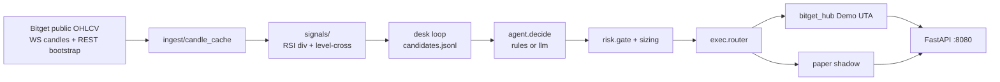

# Bitget S2 — Divergent Agent Desk

[](https://github.com/scanner72/bitget-bot/actions)
[](https://www.python.org/)
[](https://www.docker.com/)
[](LICENSE)

**[English](README.md)** · **[Русский](README.ru.md)** · [Architecture](docs/architecture.md) · [Risk](docs/risk-engine.md) · [API](docs/api-reference.md) · [Demo video](docs/DEMO.md) · [Submission](docs/SUBMISSION.md) · [Evidence log](docs/evidence/paper_trading_log.csv) · [Research graveyard](docs/research-graveyard.md)

Bitget AI Hackathon **S2**, track **Agentic Trading**. Public Bitget OHLCV → RSI / level-cross signals → rules or LLM decide → risk gate → **Bitget UTA Demo** (`hub_demo`) + local paper shadow → FastAPI dashboard on `:8080`.

**Not live mainnet.** `BITGET_ALLOW_LIVE=0`. Deadline **21 Sep 2026 24:00 UTC+8**. Form: [forms.gle/GyWZCMCPocgJdJon6](https://forms.gle/GyWZCMCPocgJdJon6) — submit only after GitHub + paper log + video + X post exist.

---

## What actually runs

| Piece | This desk |
|-------|-----------|
| Exec | `EXEC_MODE=hub_demo`, `BITGET_DEMO=1` — UTA Demo (`paptrading`) market open/close at `HUB_LEVERAGE=20`, exchange SL+TP2 |
| Shadow | Local paper book: ATR TP1 → SL to breakeven + trail; UI / fills |
| Scan | Full Bitget **Demo UTA** catalog (`hub_demo`). Public top-N is not used. `PAPER_FALLBACK=0` |
| TF | `TIMEFRAMES=15m,1h,4h`. `TF_BLOCKER_ENABLED=0` |
| Sides | Long and short. `ALLOWED_TYPES=BULLISH_DIV,BEARISH_DIV,LEVEL_CROSS_DOWN` (no `LEVEL_CROSS_UP`) |
| RSI long zone | `RSI_LONG_MAX=0` (off) |
| Agent | `.env.example` default `AGENT_MODE=rules`. Running desk uses `llm`. Any LLM failure falls back to rules |
| BTC filters | Regime **4h**, EMA50 off, momentum 1.2% / 4h. Pair blocker on. Correlation cap 4 same-direction |

Public candles need no keys. **Demo orders need Bitget Demo API keys in local `.env` (never commit).**

---

## Weekend thesis

S2’s premise: tokenized US stocks and crypto perps trade **7×24**. Humans sleep; this desk does not.

**Claim:** RSI-momentum divergence plus `LEVEL_CROSS_DOWN` on `15m`/`1h`/`4h`, gated by `risk/gate.py` and sized to stop, is enough to run an autonomous **event → decision → Bitget Demo UTA fill** loop through weekends — without a TF ban, without mixing paper-live PnL into Demo equity, and without turning the agent into a research council or on-chain attester.

rToken perps stay open on weekends (1h ATR, no crypto 2% floor). `TF_BLOCKER_ENABLED=0`. Pair blocker stays on. `RSI_LONG_MAX=0`.

| Keep | Rejected — [research-graveyard](docs/research-graveyard.md) |
|------|------|
| `hub_demo` + paper shadow, `BITGET_ALLOW_LIVE=0` | Live mainnet |
| SHA-256 decision JSONL + `session_id` / `context` / `manifest_hash` | Optic-style multi-agent debate, on-chain attestation |
| `TF_BLOCKER_ENABLED=0` | 15m TF ban (it zeroed the desk) |
| Demo catalog only (`PAPER_FALLBACK=0`) | Counting paper-live PnL as Demo equity |

Verify a decision log: `python scripts/verify_decision_log.py` (uses [`docs/evidence/fixtures/decisions.hashed.jsonl`](docs/evidence/fixtures/decisions.hashed.jsonl)).

---



---

## Risk (from `.env.example`)

| Control | Env | This desk |
|---------|-----|-----------|
| Risk per trade (to SL) | `RISK_USD_PER_TRADE` | `10` |
| Max / min notional | `MAX_NOTIONAL_USD` / `MIN_NOTIONAL_USD` | `500` / `10` |
| Daily loss kill | `MAX_DAILY_LOSS_USD` | `150` |
| Max positions | `MAX_POSITIONS` | `15` |
| Same-direction cap | `MAX_SAME_DIRECTION_POSITIONS` | `4` |
| Cooldown | `COOLDOWN_SEC` | `900` |
| Dollar stop | `MAX_LOSS_PCT_OF_MARGIN` | `40` |
| Hub leverage | `HUB_LEVERAGE` | cap `20`, adaptive `35/SL%` (`PAPER_LEVERAGE` stays 1) |
| Pair blocker | `PAIR_BLOCKER_ENABLED` | `1` (3 consecutive losses / WR 30 / 48h) |
| TF blocker | `TF_BLOCKER_ENABLED` | `0` |
| Symbol deny | `MEME_DENY_*`, `TRADE_DENY_SYMBOLS` | `USDCUSDT` always; meme bases (DOGE, SHIB, PEPE, BONK, WIF, FLOKI, 1000/1M prefixes) on by default. `MEME_DENY_ALLOW` removes a base |

Sizing: `notional = clamp(RISK / (|entry-sl|/entry), MIN, MAX)`. If those env vars are missing, code falls back to risk `2` / max `100` — this repo’s example file is the intended desk.

ATR levels on open: `ATR = mean(high-low).tail(14)`, floor `max(atr, entry×0.02)`; long SL=`entry-1×ATR`, TP1=`+1.5×ATR`, TP2=`+2.5×ATR` (short mirrored). Skip if `atr_pct` &lt; 0.3% or &gt; 6%.

---

## Quick start

### Docker (judges / overnight desk)

```bash
cp .env.example .env          # Windows: copy .env.example .env
# Fill BITGET_* Demo keys. Optional: AGENT_MODE=llm + Groq key
docker compose up -d --build
```

Dashboard: [http://127.0.0.1:8080](http://127.0.0.1:8080) · health: `/health` must show `"ok": true`, `"exec_mode": "hub_demo"`.

```bash
docker compose logs -f desk
docker compose down
```

Windows: `.\start.ps1` · Linux/macOS: `./start.sh` (same compose path; falls back to `.venv` if Docker is down).

### Local venv

```bash
python -m venv .venv
.venv/bin/python -m pip install -r requirements.txt   # Windows: .venv\Scripts\python.exe
copy .env.example .env
.venv/bin/python scripts/run_api.py
.venv/bin/python scripts/run_signal_loop.py --poll
```

Offline smokes: `.\test.ps1` or `./test.sh`. Hub/Demo smokes need keys: `scripts/smoke_bitget.py`, `scripts/smoke_hub_demo.py`.

---

## API

| Method | Path | Body |
|--------|------|------|
| GET | `/health` | `{ ok, paper, exec_mode, hub_demo, bitget_demo, hub_sync_exchange_sl, paper_fallback, agent_mode, openai_model }` |
| GET | `/positions` | `{ positions, count, source, total_unrealized_pnl, … }` |
| GET | `/account` · `/equity` | Paper snapshot + Demo equity overlay when `hub_demo` |
| GET | `/decisions?limit=50` | `{ decisions, count }` from `data/decisions.jsonl` (each row: `hash`, `prev_hash`, `session_id`, `context`, `manifest_hash`) |
| GET | `/candidates?limit=50` | `{ candidates, count }` |
| GET | `/fills?limit=50` | `{ fills, count, source }` |
| GET | `/history?limit=40` | `{ trades, count }` |
| GET | `/` | HTML dashboard (click row → chart) |
| GET | `/ui/live` | HTML fragment for live refresh |
| GET | `/chart` | Overlay chart page |
| GET | `/api/chart/data` | `{ candles, rsi, markers, … }` public OHLCV |

Details: [docs/api-reference.md](docs/api-reference.md).

### Demo money vs paper shadow

`paper shadow` is the local mirror of Demo positions used for ATR exits, TP1/BE/trailing, risk state, and chart history. It is not a second exchange balance.

- **Money source of truth:** [`/equity`](http://127.0.0.1:8080/equity) (current Demo equity), then [`/fills`](http://127.0.0.1:8080/fills?limit=100) (`exec_pnl` + fees from Bitget).
- **Strategy/history view:** [`/history`](http://127.0.0.1:8080/history?limit=200) and the dashboard Trade history tab, reconstructed from `data/paper_fills.jsonl`.
- If paper `realized_pnl` differs from hub `exec_pnl`, reports must use the hub value for money and explicitly label the paper value as an estimate.

---

## Evidence (Track 1 paper / Demo log)

Bitget S2 Trading Agent checklist: timestamp, trading pair, direction, price, quantity, account balance change (plus status / mode).

| File | Role |
|------|------|
| [`docs/evidence/paper_trading_log.csv`](docs/evidence/paper_trading_log.csv) | Public **UTA Demo** log (**not live mainnet**, not paper-live fallback) |
| [`docs/evidence/s2_validation.md`](docs/evidence/s2_validation.md) | Reproducible observed metrics, costs and limitations |
| [`docs/S2_FORM_COPY.md`](docs/S2_FORM_COPY.md) | Ready-to-paste five-part S2 submission text and links |
| [`docs/evidence/README.md`](docs/evidence/README.md) | Field map + how to regenerate |
| [`docs/evidence/paper_trading_log.sample.csv`](docs/evidence/paper_trading_log.sample.csv) | `SIMULATED_DEMO` snapshot from native fills |

```bash
python scripts/capture_demo_artifacts.py
python scripts/export_paper_log.py --refresh-desk-fixture
python scripts/generate_s2_validation.py
python scripts/export_paper_log.py --from-desk      # UTA Demo fills only (default)
python scripts/export_paper_log.py                  # local data/paper_fills.jsonl, else desk fixture
python scripts/export_paper_log.py --from-sample    # tiny offline fixture, no keys
```

---

## Layout

| Path | Role |
|------|------|
| `ingest/` | Public WS candles + REST bootstrap, universe scan |
| `signals/` | RSI-momentum divergence + level-cross (`engine.py`, `divergence/`) |
| `desk/` | Scan → candidate JSONL → decide → risk → router |
| `agent/decide.py` | `ENTER` / `SKIP` / `REDUCE`; `rules` or `llm` |
| `risk/` | Gate, risk-to-SL sizing, ATR exits, pair blocker |
| `exec/` | Router, Bitget UTA hub, paper book, Demo overlay |
| `api/app.py` | Dashboard `:8080` |
| `scripts/smoke_*.py` | Smokes |
| `docs/DEMO.md` | 2–3 min recording script |
| `docs/SUBMISSION.md` | GitHub / video / X / form checklist |
| `docs/research-graveyard.md` | Rejected approaches (TF ban, debate/attestation, paper-live as Demo) |
| `docs/evidence/` | Paper / Demo trading log (Track 1) |

Compose services: `api` (`bitget-desk-api`) and `desk` (`bitget-desk-loop`), volume `./data`.

---

## Hackathon pack

- Video: [docs/DEMO.md](docs/DEMO.md)
- Submit checklist: [docs/SUBMISSION.md](docs/SUBMISSION.md)
- Paper / Demo log: [docs/evidence/paper_trading_log.csv](docs/evidence/paper_trading_log.csv)
- Decision hashes: `python scripts/verify_decision_log.py`
- What we tried and dropped: [docs/research-graveyard.md](docs/research-graveyard.md)
- Agent notes: [docs/CURSOR_HANDOFF.md](docs/CURSOR_HANDOFF.md)
- Handbook: [bitget-ai.gitbook.io/bitgetai_hackathons2](https://bitget-ai.gitbook.io/bitgetai_hackathons2)

**EN:** Educational Demo UTA bot. Not financial advice.  
**RU:** Учебный стол на Bitget Demo. Не инвестиционная рекомендация.
