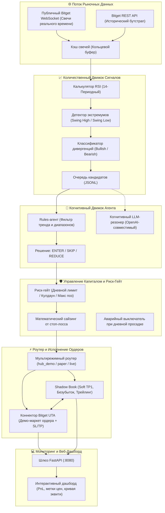

<div align="center">

# 🛸 Bitget S2 — Divergent Agent Desk
### Автономный Количественный Торговый Агент, Анализ Дивергенций и Исполнение на Bitget UTA с Paper Shadow Book

[](https://github.com/scanner72/bitget-bot/actions)
[](https://www.python.org/)
[](https://fastapi.tiangolo.com/)
[](https://github.com/ccxt/ccxt)
[](https://www.bitget.com)
[](https://www.docker.com/)
[](LICENSE)

**[English](README.md)** • **[Русский](README.ru.md)** • **[Архитектура](docs/architecture.md)** • **[Модуль Риска](docs/risk-engine.md)** • **[Стратегия](docs/strategy-divergence.md)** • **[API Спецификация](docs/api-reference.md)** • **[Развертывание](docs/deployment-guide.md)** • **[AI Флот](docs/agents-setup.md)**

<p align="center">
  <b>Bitget S2 Divergent Agent Desk</b> объединяет квант-анализ микроструктуры рынка с автономным когнитивным трейдингом.<br/>
  Потоковый сбор 100% публичных свечей Bitget, автоматическое распознавание RSI-дивергенций, жесткий математический контроль рисков и исполнение на демо-аккаунте <b>Bitget Universal Trading Account (UTA)</b> с параллельным ведением теневой книги paper-ордеров.
</p>

---

</div>

## 🌟 Почему Divergent Agent Desk?

Большинство розничных торговых ботов страдают от двух критических проблем:
- **Негибкие сеточные боты (Grid Bots)**: Усредняются против тренда вплоть до полной ликвидации депозита при сильных импульсных движениях.
- **Переоптимизированные «черные ящики»**: Опираются на запаздывающие индикаторы без учета дивергенций импульса, смены рыночных режимов и поэтапной фиксации прибыли.
- **Неконтролируемая просадка**: Фиксированный размер ордеров приводит к катастрофическим потерям при всплесках волатильности.

**Bitget S2 Divergent Agent Desk предлагает институциональный квант-подход:**
1. **Сбор данных без ключей**: Потоковое получение свечей через публичный WebSocket и REST без риска компрометации API-ключей.
2. **Структурные RSI-дивергенции**: Определение реальных фаз накопления и распределения крупными игроками.
3. **Расчет позиции от расстояния до Stop-Loss**: Размер каждой позиции математически вычисляется от расстояния до стоп-лосса, гарантируя точный долларовый лимит потерь.
4. **Исполнение на Bitget UTA Demo с Shadow Book**: Выставление рыночных ордеров и биржевых стоп-лоссов на Bitget с локальным ведением теневой книги для частичной фиксации (TP1) и перевода стопа в **Безубыток (Break-Even)**.

---

## ⚡ Сравнительная Матрица Возможностей

| Возможность | Divergent Agent Desk | 3Commas / Bitsgap | Freqtrade | Hummingbot | Bitget Копитрейдинг |
|:---|:---:|:---:|:---:|:---:|:---:|
| **Публичные данные (Без API ключей)** | **✅ WebSocket + REST** | ❌ Нужны ключи | ⚠️ Зависит от биржи | ⚠️ Зависит от биржи | ❌ Закрыто |
| **Точный сайзинг от дистанции до SL** | **✅ Расчет точного убытка**| ❌ Фикс / % от баланса | ⚠️ Писать вручную | ❌ Ручной спред | ❌ Фикс коэффициент |
| **Поддержка Bitget UTA v3 Demo** | **✅ Нативный `hub_demo`** | ⚠️ Базовый API | ⚠️ Базовый CCXT | ⚠️ Частично | ❌ Только Live |
| **Многостадийные выходы (TP1 / BE / Trail)** | **✅ Paper Shadow Book** | ⚠️ Частично / Платно | ⚠️ Писать вручную | ❌ Нет | ❌ Зависит от трейдера |
| **Автоматический Daily Loss Killswitch** | **✅ Встроенный Risk Gate** | ⚠️ Базовый | ⚠️ Кастомные хуки | ❌ Нет | ❌ Нет |
| **Реактивный Веб-Дашборд (:8080)** | **✅ FastAPI + Realtime PnL** | ⚠️ Только облако | ⚠️ Плагин веб-сервера | ❌ Только CLI | ⚠️ Приложение Bitget |
| **Когнитивный слой (Rules / LLM)** | **✅ Встроенный агент** | ❌ Нет | ❌ Нет | ❌ Нет | ❌ Только человек |
| **100% Приватность и Self-Hosted** | **✅ Лицензия MIT** | ❌ Закрытый SaaS | ✅ Self-hosted | ✅ Self-hosted | ❌ Централизовано |

---

## 🏛️ Архитектура Системы



---

## 🛡️ Параметры Контроля Рисков

| Параметр | Переменная окружения | По умолчанию | Назначение |
|:---|:---|:---:|:---|
| **Риск на сделку** | `RISK_USD_PER_TRADE` | `$2.00` | Фиксированный долларовый убыток при срабатывании Stop-Loss. |
| **Максимальный объем** | `MAX_NOTIONAL_USD` | `$100.00` | Предельный объем позиции по одной сделке. |
| **Минимальный объем** | `MIN_NOTIONAL_USD` | `$10.00` | Минимальный допустимый биржей объем позиции. |
| **Дневной лимит потерь** | `MAX_DAILY_LOSS_USD` | `$50.00` | Аварийный выключатель, блокирующий новые сделки до 00:00 UTC. |
| **Максимум открытых позиций** | `MAX_POSITIONS` | `8` | Предельное число одновременно открытых позиций. |
| **Кулдаун по монете** | `COOLDOWN_SEC` | `900` | 15-минутная пауза перед повторным входом по той же паре. |

👉 **[Подробная спецификация модуля рисков](docs/risk-engine.md)**

---

## 🌐 Универсальная Кросс-Платформенная Архитектура

Bitget S2 Divergent Agent Desk спроектирован для работы на **Linux**, **macOS** и **Windows**:

| Компонент / Возможность | 🐧 Linux (Ubuntu, Debian, Arch) | 🍏 macOS (Apple Silicon & Intel) | 🪟 Windows (10, 11, WSL2) |
|:---|:---|:---|:---|
| **Контейнеризация** | Docker Engine 24+ и Docker Compose | Docker Desktop (Native `arm64` / `amd64`) | Docker Desktop (WSL2 Backend) |
| **Среда Python** | Нативный Python 3.11 / 3.12 | Нативный Python 3.11 / 3.12 | Нативный Python 3.11 / 3.12 |
| **Запуск в 1 клик** | `./start.sh` | `./start.sh` | `.\start.ps1` или `start.bat` |
| **Автоматические тесты** | `./test.sh` | `./test.sh` | `.\test.ps1` |
| **Деплой на удаленный сервер** | `./deploy-remote.sh` | `./deploy-remote.sh` | `.\deploy-remote.ps1` |

---

## 🚀 Быстрый Старт за 60 Секунд

### 1. Запуск через Скрипт в 1 Клик
```powershell
# Windows (PowerShell):
.\start.ps1

# Linux / macOS:
./start.sh
```

### 2. Либо через Docker Compose
```bash
cp .env.example .env
docker compose up -d --build
```

### 3. Точки Входа и Дашборд

| Сервис | Ссылка | Назначение |
|:---|:---|:---|
| **Веб-дашборд** | [http://localhost:8080](http://localhost:8080) | Live PnL, котировки, позиции и кривая капитала |
| **REST Health** | [http://localhost:8080/health](http://localhost:8080/health) | Проверка работоспособности и статуса режима |
| **Кандидаты** | [http://localhost:8080/candidates](http://localhost:8080/candidates) | Поток активных дивергенций RSI |
| **Позиции** | [http://localhost:8080/positions](http://localhost:8080/positions) | Открытые позиции и статус мягких выходов |

> 💡 **Для тестирования ключи биржи не требуются:** Рыночные данные на 100% публичны, а в режиме paper ордера эмулируются локально!

---

## 🤖 Интеграция с AI-Агентами и Remote Context

- **Cursor и Windsurf**: Настроены через [`.cursorrules`](.cursorrules).
- **Claude Code CLI и Claude Desktop**: Настроены через [`CLAUDE.md`](CLAUDE.md).
- **Google Antigravity**: Настроен через [`AGENTS.md`](AGENTS.md).
- **Синхронизация через Remote Context**: Подключитесь к [Remote Context (`context-sync`)](https://github.com/scanner72/context-sync) для сохранения торговых решений, калибровок выходов и правил риска в общую память флота.

👉 **[Инструкция по настройке ИИ-агентов](docs/agents-setup.md)**

---

## 💻 Развертывание на Удаленном Сервере (VPS)

Деплой на удаленный Linux-сервер (AWS, Hetzner, DigitalOcean) выполняется одной командой:

```powershell
# Windows:
.\deploy-remote.ps1 -RemoteHost "10.10.10.11" -RemoteUser "operator" -RemotePath "/opt/bitget-bot"
```

```bash
# Linux / macOS:
./deploy-remote.sh 10.10.10.11 operator /opt/bitget-bot
```

👉 **[Инструкция по развертыванию на продакшн](docs/deployment-guide.md)**

---

## 🧪 Тестирование и Валидация

Запуск автоматических тестов:
```powershell
# Windows:
.\test.ps1

# Linux / macOS:
./test.sh
```

---

## 🤝 Вклад в Проект (Contributing)

Мы приветствуем новые идеи и оптимизации алгоритмов:
- **[CONTRIBUTING.md](CONTRIBUTING.md)**: Создание PR и стиль кода.
- **[CODE_OF_CONDUCT.md](CODE_OF_CONDUCT.md)**: Кодекс взаимодействия участников.
- **[SECURITY.md](SECURITY.md)**: Политика безопасности и оповещения об уязвимостях.

---

## 📄 Лицензия

Распространяется под лицензией **MIT**. Подробности в файле [LICENSE](LICENSE).

<div align="center">
  <sub>Создано с ❤️ для количественных трейдеров и разработчиков автономных торговых агентов.</sub>
</div>
