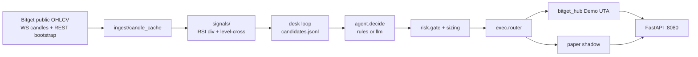

# Architecture

Divergent Agent Desk: public Bitget market data in, Demo UTA orders out, paper shadow for soft exits and UI.

## Directories

| Path | What it does |
|------|----------------|
| `ingest/bitget_ws.py`, `bitget_ohlcv.py`, `candle_cache.py` | Public WS candles/tickers (`MARKET_DATA_MODE=ws`) + REST bootstrap. No keys. Cache is the configured TF (`TIMEFRAME=15m`), not a 1m/5m/15m stack. |
| `ingest/universe.py` | Auto-scan USDT-M swaps only: crypto + rToken/RWA (`SCAN_CRYPTO_TOP=70`, `SCAN_RTOKEN_TOP=30`). |
| `signals/engine.py`, `signals/divergence/` | Wilder RSI 14, swing pivots, `BULLISH_DIV` / `BEARISH_DIV` / `LEVEL_CROSS_*`. |
| `desk/` | Poll loop: candles → signals → `data/candidates.jsonl` → decide → gate → router. |
| `agent/decide.py` | `AGENT_MODE=rules` or `llm` (OpenAI-compatible). `llm` = rules first, model may only SKIP. LLM errors keep rules ENTER (`llm_fallback`). |
| `risk/gate.py`, `sizing.py`, `exits.py`, `atr.py` | Limits, risk-to-SL notional, ATR SL/TP1/TP2, pair blocker. |
| `exec/router.py`, `bitget_hub.py`, `paper.py` | `hub_demo` / `paper` / `live` (live needs `BITGET_ALLOW_LIVE=1`). |
| `api/app.py` | Dashboard and JSON on port **8080**. |

## Execution modes

| `EXEC_MODE` | Behavior |
|-------------|----------|
| `hub_demo` | Bitget UTA Demo market + exchange SL/TP2; paper shadow for TP1/BE/trail and UI. |
| `paper` | Local fills only. |
| `live` | Blocked unless `BITGET_ALLOW_LIVE=1`. Not for the hackathon demo. |

`PAPER_FALLBACK=1` in `hub_demo`: if the pair is not on Demo, fill the paper book at live mark. Demo wallet equity stays Bitget; paper-live is a separate book.

## Ports

| Service | Port |
|---------|------|
| FastAPI (`bitget-desk-api`) | `8080` |
| Desk loop (`bitget-desk-loop`) | none (writes `data/`) |
| Bitget | outbound `443` HTTPS / WSS |
