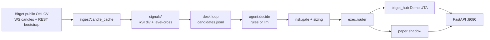

# Architecture

Divergent Agent Desk: public Bitget market data in, Demo UTA orders out, paper shadow for soft exits and UI.

## Directories

| Path | What it does |
|------|----------------|
| `ingest/bitget_ws.py`, `bitget_ohlcv.py`, `candle_cache.py` | Public WS candles/tickers (`MARKET_DATA_MODE=ws`) + REST bootstrap. No keys. Cache is `TIMEFRAMES=15m,1h,4h`. |
| `ingest/universe.py` | Auto-scan USDT-M swaps: crypto + rToken (`SCAN_CRYPTO_TOP=70`, `SCAN_RTOKEN_TOP=30`) in paper/live. `hub_demo` scans the **full** Demo instrument catalog. |
| `signals/engine.py`, `signals/divergence/` | Wilder RSI 14, swing pivots, `BULLISH_DIV` / `BEARISH_DIV` / `LEVEL_CROSS_*`. |
| `desk/` | Poll loop: candles → signals → `data/candidates.jsonl` → decide → gate → router. Decisions are hashed in `desk/decision_log.py`. |
| `agent/decide.py` | `AGENT_MODE=rules` or `llm` (OpenAI-compatible). LLM errors → rules + `llm_fallback`. |
| `risk/gate.py`, `sizing.py`, `exits.py`, `atr.py` | Limits, risk-to-SL notional, ATR SL/TP1/TP2, pair blocker. |
| `exec/router.py`, `bitget_hub.py`, `paper.py` | `hub_demo` / `paper` / `live` (live needs `BITGET_ALLOW_LIVE=1`). |
| `api/app.py` | Dashboard and JSON on port **8080**. |
| `docs/research-graveyard.md` | Rejected approaches (not part of the running desk). |

## Execution modes

| `EXEC_MODE` | Behavior |
|-------------|----------|
| `hub_demo` | Bitget UTA Demo market at `HUB_LEVERAGE=20` + exchange SL/TP2; paper shadow for TP1/BE/trail and UI. |
| `paper` | Local fills only. |
| `live` | Blocked unless `BITGET_ALLOW_LIVE=1`. Not for the hackathon demo. |

`PAPER_FALLBACK=0` (default): `hub_demo` scans **all** symbols in the Bitget Demo instrument catalog (not public top-N). `PAPER_FALLBACK=1` restores paper-live fills at live mark for names missing on Demo. That PnL is a separate book from Demo equity.

### Accounting boundaries

In `hub_demo`, Bitget is the source of truth for money and whether a position exists:

- `GET /equity`: authoritative Demo equity and unrealized PnL.
- `GET /fills`: authoritative exchange execution PnL (`exec_pnl`) and fees.
- `data/paper_positions.json` / `data/paper_fills.jsonl`: local paper shadow for exit state, risk bookkeeping and UI history.

The shadow follows Demo orders but is not guaranteed to reproduce exchange PnL exactly. Reconciliation closes local ghosts; it does not turn a locally calculated `realized_pnl` into a Bitget wallet value. Reports must keep Demo and shadow values separately labeled.

## Ports

| Service | Port |
|---------|------|
| FastAPI (`bitget-desk-api`) | `8080` |
| Desk loop (`bitget-desk-loop`) | none (writes `data/`) |
| Bitget | outbound `443` HTTPS / WSS |
