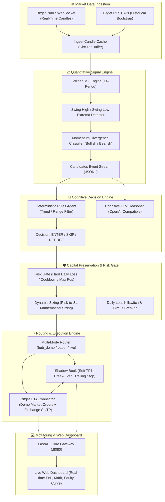

# 🏛️ Bitget S2 Divergent Agent Desk Architecture & System Design

This document details the architectural principles, component interactions, data pipelines, and execution engines of the **Bitget S2 Divergent Agent Desk**.

---

## 1. High-Level System Architecture

Bitget S2 Divergent Agent Desk is an autonomous quantitative trading agent designed specifically for **Bitget Universal Trading Accounts (UTA)**. It processes real-time public market data, extracts RSI-momentum structural divergences, evaluates risk constraints, and executes positions with a synchronized paper-shadow book.

---

## 2. Component Breakdown

### 2.1 Ingestion & Market Feeds (`ingest/`)
- **Transport**: WebSockets (`MARKET_DATA_MODE=ws`) with REST fallback.
- **Data Source**: 100% public Bitget OHLCV market streams. Zero API keys required for market scanning.
- **Buffer**: In-memory circular candle buffers maintaining rolling 1m, 5m, and 15m timeframes.

### 2.2 Quantitative Signal Engine (`signals/`)
- **Divergence Logic**: Compares price structure swings against RSI oscillator extremes.
  - *Bullish Divergence*: Lower low in price + higher low in RSI oscillator.
  - *Bearish Divergence*: Higher high in price + lower high in RSI oscillator.
- **Extreme Filters**: Automatically discards candidates if RSI is already pinned in deep overbought (>75) or oversold (<25) exhaustion zones.

### 2.3 Cognitive Agent Layer (`agent/`)
- **Dual Mode**:
  - `AGENT_MODE=rules` (Default): High-speed, deterministic heuristic evaluation of market regime.
  - `AGENT_MODE=llm`: Integrates local or cloud LLMs (Ollama, LM Studio, DeepSeek, OpenAI) to assess market regime, volatility, and order context.

### 2.4 Mathematical Risk Gate (`risk/`)
- **Risk-to-SL Sizing**: Sizes position notional such that if the Stop-Loss is hit, the exact configured dollar loss (`RISK_USD_PER_TRADE`) is incurred:
  $$\text{Notional} = \frac{\text{Risk Amount (USD)}}{|\text{Entry Price} - \text{SL Price}| / \text{Entry Price}}$$
- **Bounded Exposure**: Constrained by `MIN_NOTIONAL_USD` and `MAX_NOTIONAL_USD`.
- **Circuit Breakers**: Rejects orders if daily unrealized/realized loss exceeds `MAX_DAILY_LOSS_USD` or if max open positions (`MAX_POSITIONS`) are reached.

### 2.5 Execution Router & Bitget UTA Hub (`exec/`)
- **Modes**:
  - `EXEC_MODE=hub_demo`: Places native demo market orders on Bitget Universal Trading Account (UTA) with server-side SL and TP2 on the exchange.
  - `EXEC_MODE=paper`: 100% local in-memory simulation with simulated fills and slippage.
  - `EXEC_MODE=live`: Production execution (guarded by `BITGET_ALLOW_LIVE=1`).
- **Paper Shadow Synchronization**: Monitors live tick updates, managing partial soft Take-Profit (TP1), moving SL to Break-Even (BE), and calculating trailing stops.

---

## 3. Network Architecture & Ports

| Service | Port | Protocol | Purpose |
|:---|:---:|:---:|:---|
| **FastAPI Web Dashboard** | `8080` | HTTP / REST | Web UI, real-time telemetry, PnL monitoring |
| **Desk Loop** | Background | Internal Thread / Process | Signal generation and execution loop |
| **Bitget UTA Gateway** | 443 | HTTPS / WSS | Outbound connection to `api.bitget.com` |
